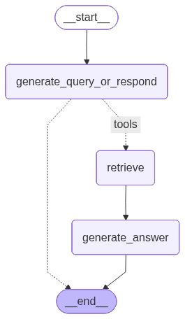

# Documentation

## RAG Template for Retrieval-Augmented Generation Applications

This README documents a template designed for building Retrieval-Augmented Generation (RAG) based applications. RAG systems combine information retrieval with generative AI models to provide more accurate and contextually relevant responses by incorporating external data sources.

### Purpose
Provides a foundational template structure for developers implementing RAG architecture in their applications.


### Usage
This template serves as a starting point for projects that require:
- Document retrieval and indexing
- Query processing and context enrichment
- Generation of responses based on retrieved information
- Semantic search capabilities

### Installation

Install the UV package manager and sync dependencies:
```bash
uv sync
```

### Running the Application

Start the application using uvicorn:
```bash
uvicorn main:fastapi_app
```

### Interface

The application uses [Chainlit](https://chainlit.io/) for the conversational interface. The Chainlit application is available at the `/interface` route.

### RAG Agent Example


